# Attend App

**Attend App** adalah aplikasi Android untuk manajemen absensi yang ditujukan bagi segmen **B2B** (misalnya UMKM dan institusi pendidikan seperti sekolah). Aplikasi ini memudahkan pendataan kehadiran dengan fitur-fitur keamanan dan aksesibilitas canggih. Saat ini versi MVP (*Minimum Viable Product*) Attend App sudah selesai dikembangkan dan siap diuji.

## ✨ Fitur Utama

- **Absensi berbasis lokasi (Geofencing)**  
  Pengguna hanya dapat melakukan absen ketika berada di lokasi atau area yang sudah ditentukan sebelumnya. Attend App memanfaatkan [Android Geofencing API](https://developers.google.com/android/reference/com/google/android/gms/location/GeofencingApi) untuk mendefinisikan perimeter lokasi, sehingga aplikasi akan mendapatkan notifikasi saat perangkat memasuki area yang valid. Dengan begitu, sistem memastikan absensi hanya tercatat bila pengguna benar-benar berada di titik absen yang sah.

- **Verifikasi dengan foto selfie**  
  Saat melakukan absen, pengguna diminta mengambil foto selfie menggunakan kamera depan. Fitur ini memastikan identitas pengguna sesuai dengan data pengguna, dan mencegah kecurangan absensi. Foto disimpan aman di backend.

- **Dukungan aksesibilitas (TalkBack)**  
  Antarmuka aplikasi dirancang ramah aksesibilitas. Attend App mendukung [TalkBack](https://support.google.com/accessibility/android/answer/6007100?hl=id), yaitu screen reader bawaan Android, sehingga pengguna tunanetra atau dengan kebutuhan khusus dapat mengoperasikan aplikasi secara mudah dan mandiri.

- **Manajemen pengguna dan laporan**  
  Aplikasi menyediakan panel untuk mengelola daftar karyawan/siswa dan melihat riwayat kehadiran.

- **Notifikasi dan pengingat**  
  Attend App dapat mengirimkan notifikasi pengingat absensi sesuai jadwal yang telah diatur.

## 📸 Tampilan Aplikasi

### 🌞 Light Mode

  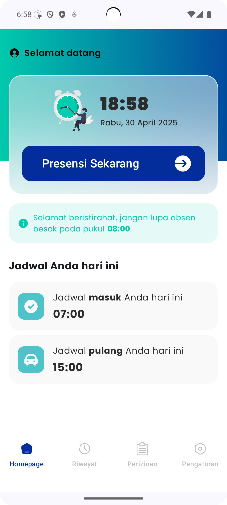
  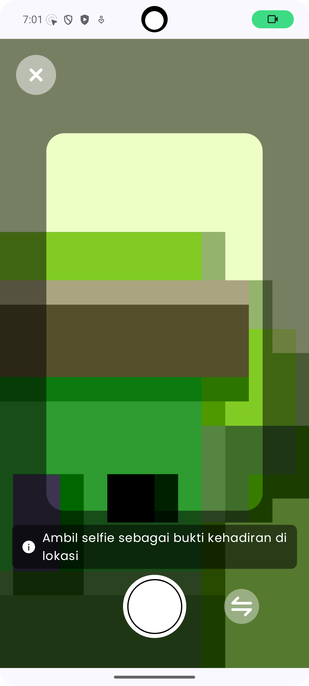
  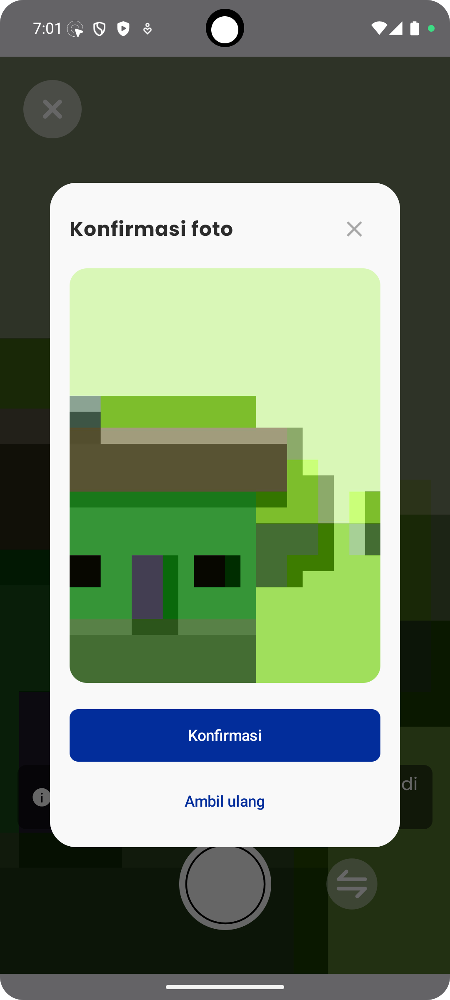
  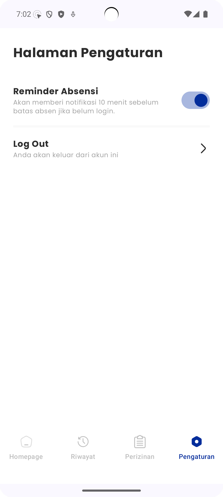

  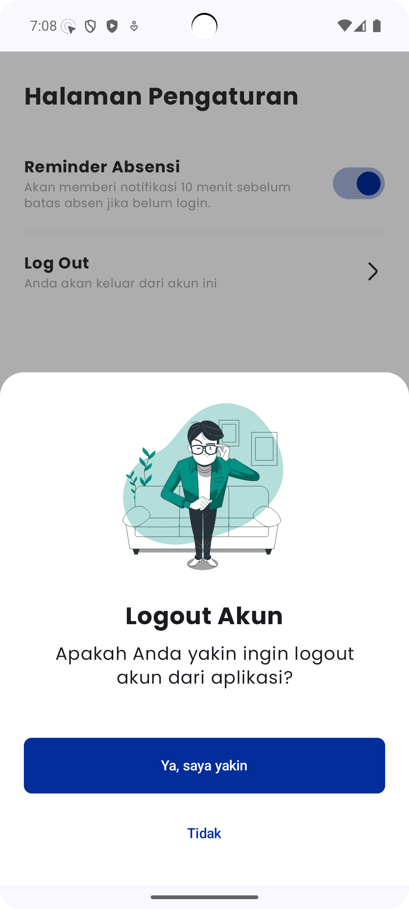
  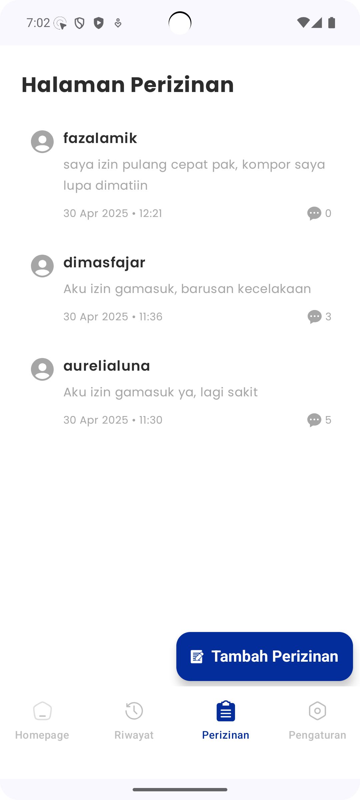
  
  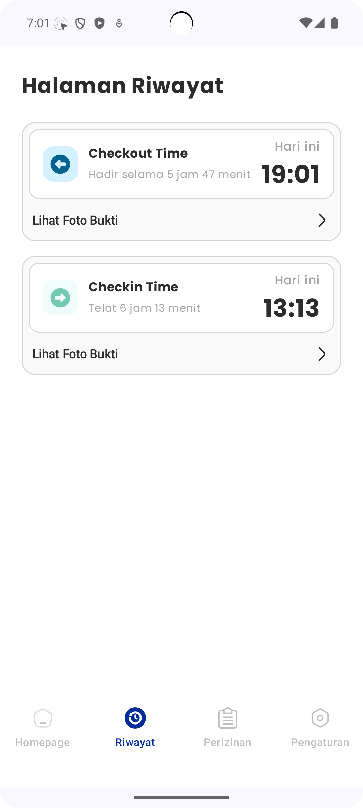

  

### 🌙 Dark Mode

  
  
  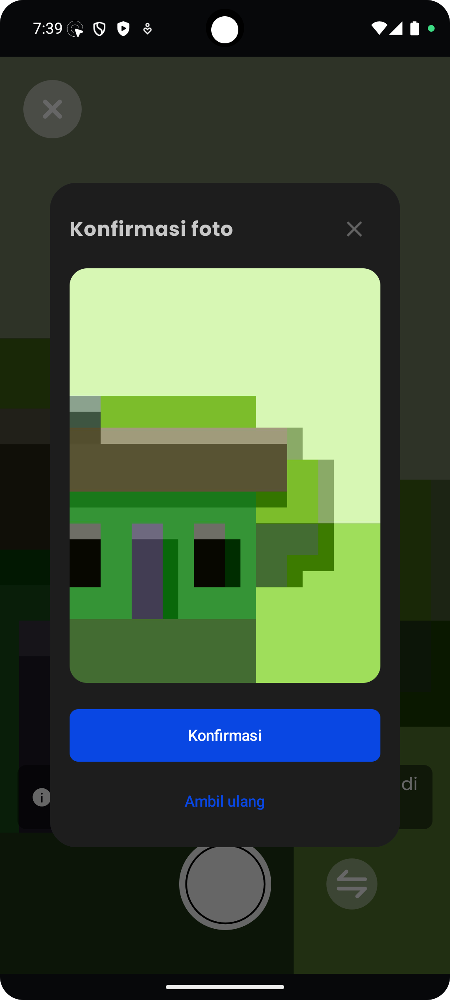
  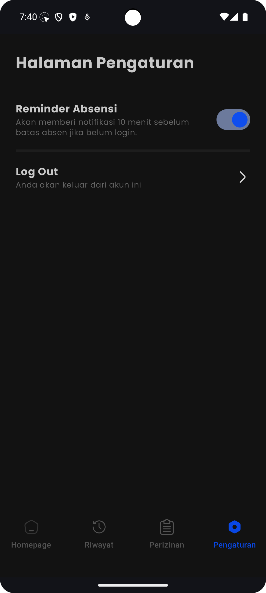

  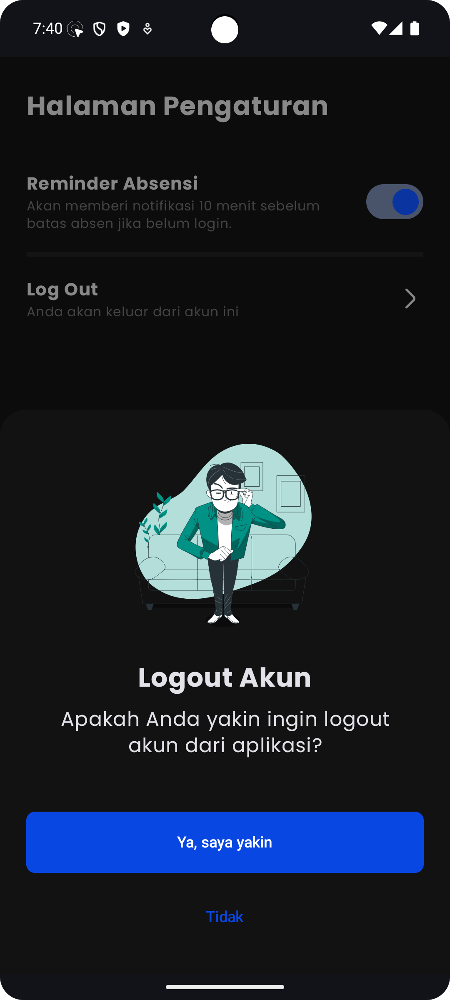
  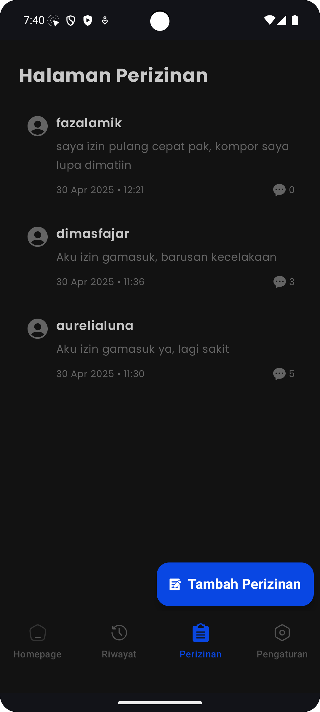
  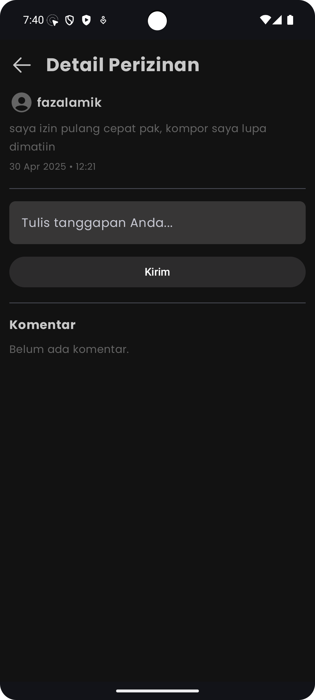
  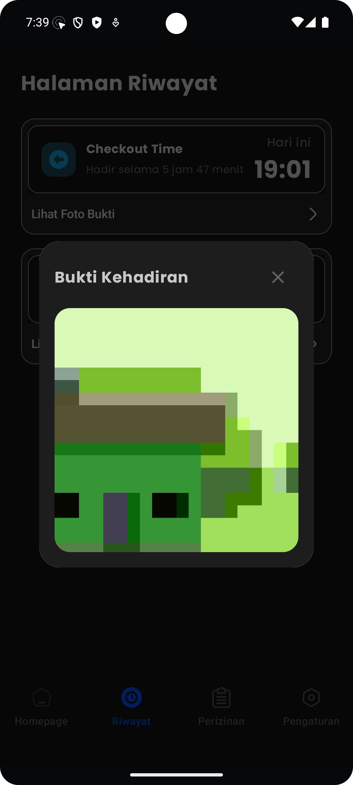

